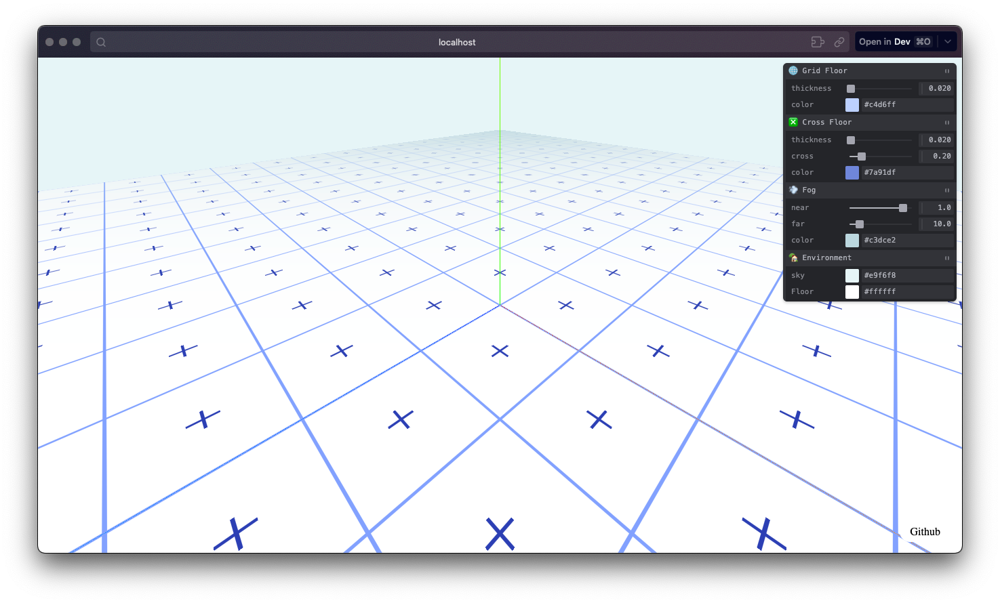
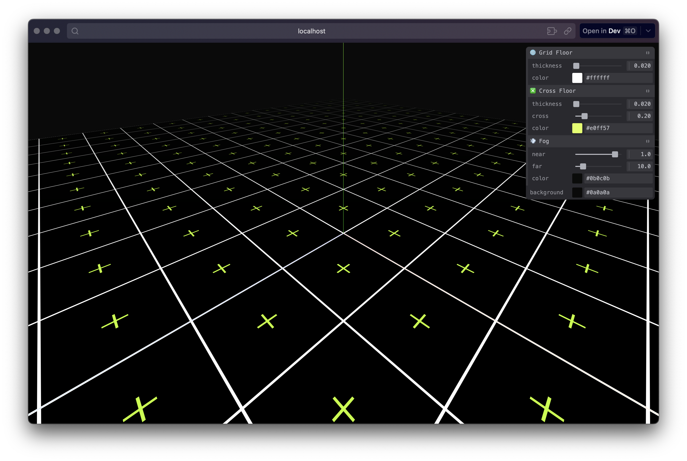
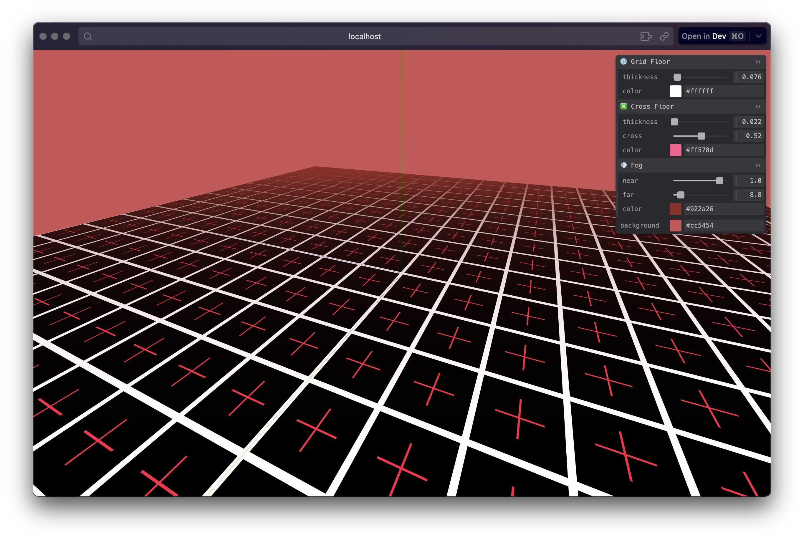
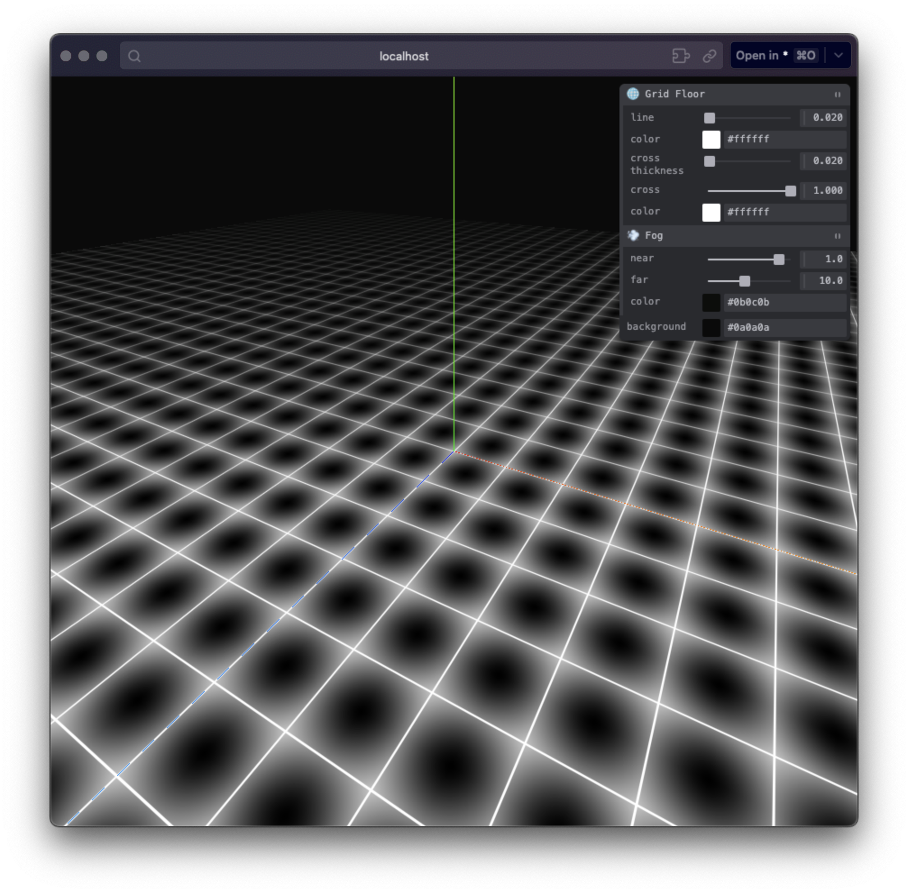
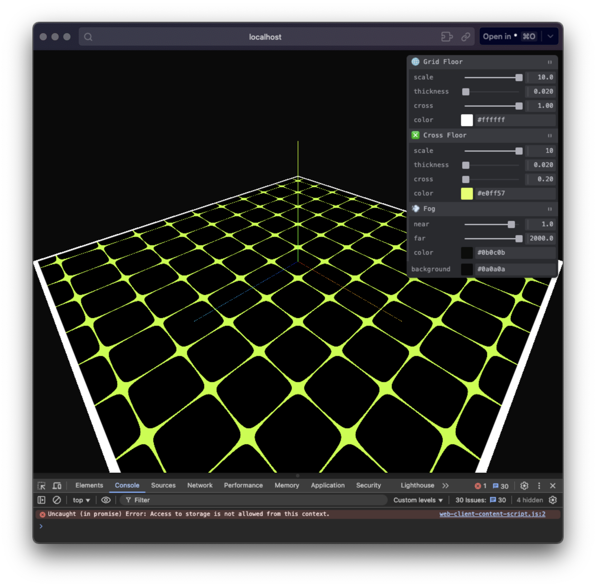

# Grid Floor

Learning how to make grid floor with glsl.

🚀 [Live Demo](https://grid-floor.vercel.app/)

💡 light style

🌚 dark style

## Customisation

-   Grid : thickness, color
-   Cross : thickness, cross intensity, color
-   Fog : color, near, far
-   Environment: sky color, floor color

## Previous version

## Accidental Founds

## Resource

The "Pristine Grid" shader from
[The Best Darn Grid Shader (Yet)](https://bgolus.medium.com/the-best-darn-grid-shader-yet-727f9278b9d8)
